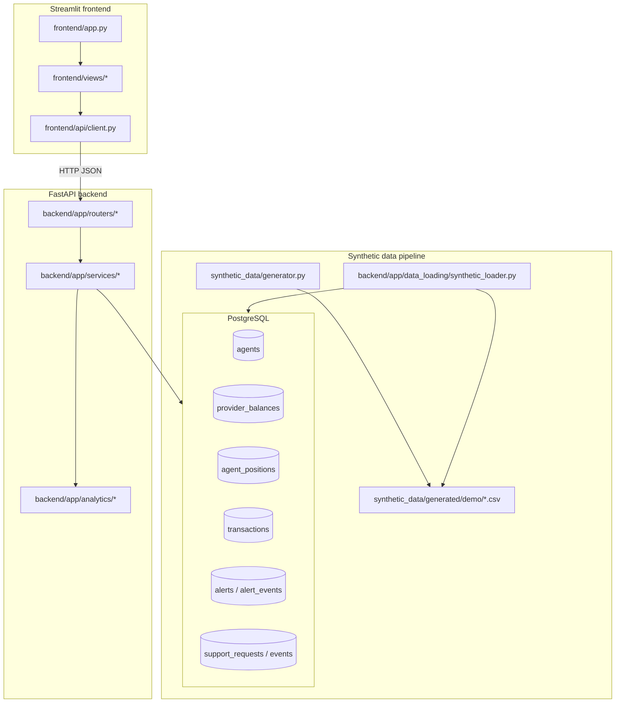
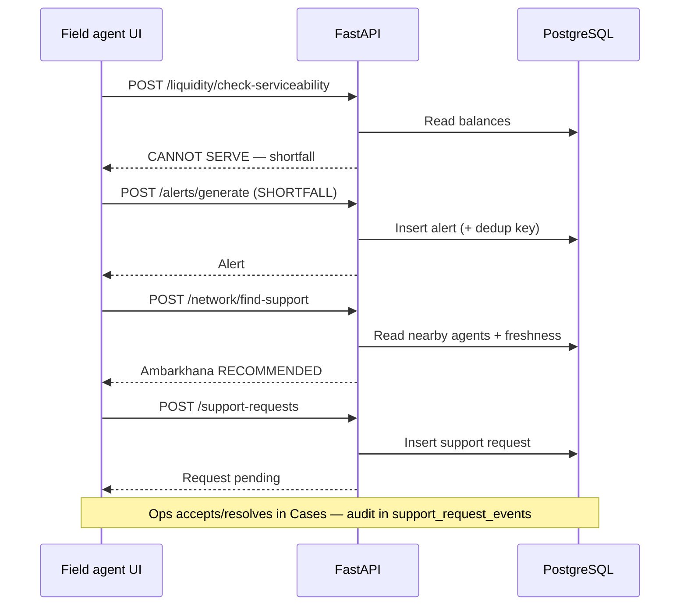

# Architecture — Super Agent Liquidity and Risk Intelligence Platform

This document explains how the repository is structured so judges and
reviewers can understand the system without reading every file.

For a live demo walkthrough, see [DEMO_GUIDE.md](DEMO_GUIDE.md).  
For AI-assisted development records, see [prompts/README.md](prompts/README.md).

---

## 1. What this system does

Mobile-money **agents** in Bangladesh (bKash, Nagad, Rocket shops) need to
know whether they can serve a customer **before** accepting cash-in or
cash-out. When one branch is short on float, the network can coordinate
**peer support** from a nearby agent — ranked by distance, capacity, and
data freshness.

This prototype:

- monitors **liquidity** (shared physical cash + per-provider electronic float);
- **checks serviceability** for a customer request;
- **searches the agent network** for who can cover a shortfall;
- **forecasts runway** before balances hit a safety threshold;
- **flags unusual activity** for human review (never declares fraud);
- **persists alerts and support requests** with a full audit trail.

**Safety boundary:** synthetic data only. No real money moves. No transaction
execution API. Every risk decision requires human review.

---

## 2. High-level architecture



**Rule:** the frontend talks **only** to FastAPI over HTTP. It never opens
PostgreSQL directly.

---

## 3. Repository layout

| Path | Role |
|------|------|
| `frontend/` | Streamlit Ops Center UI — agent-first navigation |
| `frontend/api/client.py` | Single HTTP client for all backend endpoints |
| `frontend/views/` | Page renderers (Agent desk, Liquidity, Cases, Network, …) |
| `frontend/components/` | Shared UI helpers, styles, scenario metadata |
| `backend/app/main.py` | FastAPI app entry point and router registration |
| `backend/app/routers/` | HTTP route handlers (thin — delegate to services) |
| `backend/app/services/` | Business logic (liquidity, alerts, network, dashboards) |
| `backend/app/analytics/` | Runway forecast and anomaly detection algorithms |
| `backend/app/models/` | SQLAlchemy ORM models |
| `backend/app/schemas/` | Pydantic request/response contracts |
| `backend/app/data_loading/` | Load synthetic CSV scenarios into PostgreSQL |
| `backend/alembic/` | Database migrations |
| `synthetic_data/` | Deterministic demo data generator and CSV outputs |
| `prompts/` | AI prompt records (required per commit for judging) |
| `.github/workflows/quality.yml` | CI — tests + coverage on push |
| `DEMO_GUIDE.md` | Step-by-step judge demo script |

---

## 4. Runtime components

### 4.1 Frontend (Streamlit)

**Entry:** `frontend/app.py`

- **Default landing page:** Agent desk (`AGENT-SYL-001` Zindabazar).
- **Primary navigation:** Agent desk · Liquidity · Anomalies · Cases.
- **Network overview** (Ops Center hero, Provider Portfolio) is reachable
  from Agent desk — ops-facing, not the first screen.
- **Health pills** on load: `GET /health` and `GET /health/database`.
- **Scenario selector** filters alerts and dashboard aggregates; balances
  come from whichever scenario was last loaded into PostgreSQL.

All API access goes through `BackendClient` (`httpx`).

### 4.2 Backend (FastAPI)

**Entry:** `backend/app/main.py`

Routers registered:

| Router | Prefix | Purpose |
|--------|--------|---------|
| `agents` | `/agents` | Agent identity CRUD |
| `liquidity` | `/liquidity` | Customer serviceability checks |
| `network` | `/network` | Agent-to-agent support discovery |
| `support_requests` | `/support-requests` | Peer rescue workflow + audit |
| `forecasts` | `/forecasts` | Liquidity runway estimates |
| `anomalies` | `/anomalies` | Unusual-activity detection |
| `alerts` | `/alerts` | Alert generation + human review |
| `dashboards` | `/dashboards` | Stakeholder intelligence views |

**Pattern:** `router` → `service` → `model` / `analytics`. Routers validate
input with Pydantic schemas and map exceptions to HTTP status codes.

### 4.3 Database (PostgreSQL + Alembic)

**ORM:** SQLAlchemy 2.x · **Migrations:** Alembic (`backend/alembic.ini`)

Core tables:

| Table | Contents |
|-------|----------|
| `agents` | Branch identity, area, coordinates |
| `agent_positions` | Shared physical cash per agent |
| `providers` | bKash, Nagad, Rocket (synthetic) |
| `provider_balances` | Electronic float + freshness state |
| `transactions` | Read-only synthetic transaction history |
| `alerts` | Persisted risk work items (multilingual text) |
| `alert_events` | Acknowledge / assign / note / escalate / resolve audit |
| `support_requests` | Agent-to-agent coordination requests |
| `support_request_events` | Accept / reject / escalate / resolve audit |

Alerts and support requests **persist** across Streamlit restarts. Reloading
a synthetic scenario updates balances and transactions but does **not** clear
alerts.

### 4.4 Synthetic data

**Generator:** `synthetic_data/generator.py`  
**Output:** `synthetic_data/generated/demo/*.csv`  
**Loader:** `python -m backend.app.data_loading.synthetic_loader --scenario NETWORK-001`

Scenarios include `NETWORK-001` (multi-agent shortfall), `REPEATED-001`
(anomaly patterns), `FORECAST-001` (runway burn), `NORMAL-001`, and others.
See `synthetic_data/scenarios.py` and `frontend/components/scenarios.py`.

---

## 5. API surface (what the frontend calls)

### System

| Method | Path | Used for |
|--------|------|----------|
| GET | `/health` | API online check |
| GET | `/health/database` | PostgreSQL reachable |

### Dashboards (read-only)

| Method | Path | UI surface |
|--------|------|------------|
| GET | `/dashboards/agents/{code}` | Agent desk |
| GET | `/dashboards/operations` | Network overview, Operations view |
| GET | `/dashboards/providers/{code}` | Provider view, portfolio charts |
| GET | `/dashboards/management` | Provider Portfolio (`provider_risks`) |
| GET | `/dashboards/evaluation` | Model checks (benchmark metrics) |

### Decision support (mostly read-only checks)

| Method | Path | UI surface | Writes DB? |
|--------|------|------------|------------|
| POST | `/liquidity/check-serviceability` | Liquidity → Can we serve? | No |
| POST | `/network/find-support` | Liquidity → Find support | No |
| POST | `/forecasts/liquidity-runway` | Liquidity → Runway forecast | No |
| POST | `/anomalies/detect` | Anomalies | No |

### Workflows (persist state)

| Method | Path | UI surface |
|--------|------|------------|
| POST | `/alerts/generate` | Prompt shortfall / Run risk check |
| GET | `/alerts` | Cases inbox list |
| GET | `/alerts/{id}` | Alert detail |
| POST | `/alerts/{id}/acknowledge` | Cases workflow |
| POST | `/alerts/{id}/assign` | Cases workflow |
| POST | `/alerts/{id}/notes` | Cases workflow |
| POST | `/alerts/{id}/escalate` | Cases workflow |
| POST | `/alerts/{id}/resolve` | Cases workflow |
| POST | `/support-requests` | Request peer support |
| GET | `/support-requests` | Cases → Support requests |
| GET | `/support-requests/{id}` | Support detail |
| POST | `/support-requests/{id}/accept` | Support workflow |
| POST | `/support-requests/{id}/reject` | Support workflow |
| POST | `/support-requests/{id}/escalate` | Support workflow |
| POST | `/support-requests/{id}/resolve` | Support workflow |
| POST | `/support-requests/{id}/notes` | Support workflow |

Interactive API docs: `http://127.0.0.1:8000/docs`

---

## 6. Core workflows

### 6.1 Customer request → rescue (demo story)



**Important:** resolving an alert does **not** add float or execute a
transaction. Float only changes when a new synthetic scenario is loaded.

### 6.2 Alert lifecycle

1. **Generate** — `POST /alerts/generate` when a condition is detected
   (shortfall, runway, anomaly, stale data).
2. **Deduplicate** — same `deduplication_key` (type + agent + provider +
   scenario + evidence token) returns existing alert instead of a duplicate.
3. **Review** — human acknowledge → assign → note → escalate → resolve.
4. **Audit** — every action appends an `alert_events` row.

Resolved alerts are hidden from active counts but remain in the database.

### 6.3 Liquidity model

| Customer action | Resource checked |
|-----------------|------------------|
| Cash-in (deposit to mobile wallet) | Provider electronic float (Nagad/bKash/Rocket) |
| Cash-out (customer withdraws cash) | Shared physical cash at the branch |

Providers are **independent** — Nagad float cannot substitute for bKash.

### 6.4 Network support ranking

`POST /network/find-support` searches agents within `max_distance_km` and
ranks candidates by:

- supportable capacity (balance minus safety reserve);
- whether they can cover the shortfall;
- **freshness** of balance feed (stale data → requires confirmation).

The richest nearby agent is not always recommended if its data is stale.

---

## 7. Stakeholder views

| Stakeholder | Primary UI | Backend data |
|-------------|------------|--------------|
| Field agent | Agent desk, Liquidity | Agent dashboard, serviceability, network |
| Operations | Cases, Network overview | Alerts, support requests, operations dashboard |
| Provider (bKash/Nagad) | Provider view (role filter) | Provider dashboard |
| Management | Provider Portfolio on Network | Management dashboard (`provider_risks`) |
| Risk / audit | Anomalies, Cases history | Anomaly detection, alert events |

Multilingual alert text (English, Bangla, Banglish) is stored in the database
and selected in the frontend language control.

---

## 8. Testing and CI/CD

### Local tests

```bash
python -m pytest backend/tests -q          # ~110 tests
python -m pytest frontend/tests -q         # ~15 tests
python -m pytest synthetic_data/tests -q
```

### GitHub Actions (`.github/workflows/quality.yml`)

On every **push**:

- Python 3.12
- `pytest` on `backend/tests` and `synthetic_data/tests`
- Coverage report for `backend/app` and `synthetic_data`
- SonarQube analysis (see `sonar-project.properties`)

Frontend tests run locally; backend CI is the merge gate in the workflow
file today.

---

## 9. Configuration

| Variable | Default | Purpose |
|----------|---------|---------|
| `FASTAPI_BASE_URL` | `http://127.0.0.1:8000` | Frontend → backend URL |
| `APP_DATABASE_*` | see `.env.example` | PostgreSQL connection |

Copy `.env.example` to `.env` for local development. Secrets are never
committed.

---

## 10. What is intentionally out of scope

- Real wallet or provider API integration
- Executing financial transactions (`POST /transactions` does not exist)
- Automatic float transfer on alert resolve or support accept
- End-user authentication (prototype uses free-text actor names)
- Auto-rebalancing float across providers

These boundaries keep the hackathon scope honest: **decision support and
human-coordinated rescue**, not autonomous money movement.

---

## 11. Quick orientation for judges

1. Read this file and [DEMO_GUIDE.md](DEMO_GUIDE.md).
2. Open `http://127.0.0.1:8000/docs` for the full API contract.
3. Start at **Agent desk** in Streamlit — field-agent-first UX.
4. Follow the Nagad ৳80k shortfall story on **Liquidity** → **Cases**.
5. Check `prompts/` for AI-assisted commit history per judging requirements.
